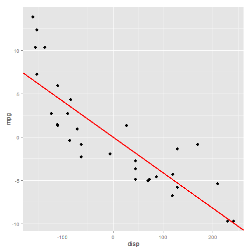

## Outline

* In this little project I wanted do demonstrate how can one manually fit the best linear regression line by changing its slope.
* There are two main panels. A navigation panel, where you can customize the view of the plot and the main panel where the plot and a short summary are located.
* Tick the `Documentation` box to see the detailed instructions on how to work with this application.

---

## Main panel

* There is a plot on the main panel (the plot itself is on the next slide):

```r
library(ggplot2)
mpg <- mtcars$mpg - mean(mtcars$mpg)
disp <- mtcars$disp - mean(mtcars$disp)
l <- lm(mpg ~ disp)
d <- data.frame(mpg, disp)
g <- ggplot(d, aes(disp, mpg))
g <- g + geom_point(size = 3) + geom_abline(intercept = 0, slope = coef(l)[2],
                                            col = 'red', size = 1)
g
```
* There is also a short summary which evaluates MSE based on the specified `beta`.

```r
mse <- mean((mpg - coef(l)[2] * disp)^2)
```

---

## Main panel


MSE of the fitted regression line is 9.911.

---

## Navigation panel

Here you can:
* Change the slope of the line using slider (this is the value which would substitute `coef(l)[2]` value in the code mentioned above).
* Change the color of the line.
* Set the title of the plot.
* View documentation.


